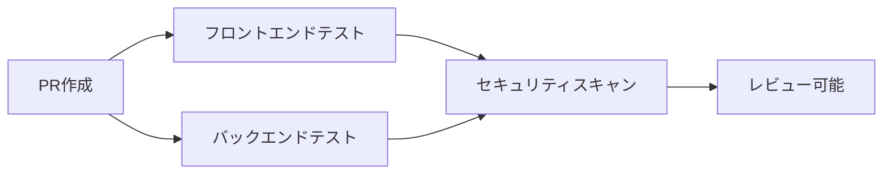
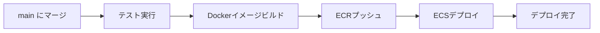

# CI/CD Setup Guide for COMPASS Design GenAI

## 概要

このプロジェクトは、GitHub Actionsを使用した自動化されたCI/CDパイプラインを備えています。

## 機能

### 🔄 自動テスト
- **フロントエンド**: Vitest + React Testing Library
- **バックエンド**: Jest + TypeScript
- **並行実行**: フロントエンドとバックエンドのテストを並行実行

### 🚀 自動デプロイ
- **トリガー**: `main`ブランチへのプッシュ時に自動実行
- **Dockerイメージ**: ECRへの自動プッシュ
- **ECS**: サービスの自動更新とゼロダウンタイムデプロイ

### 🔒 セキュリティ
- **脆弱性スキャン**: Trivyを使用したセキュリティスキャン
- **プルリクエスト**: セキュリティレポートの自動生成

## GitHub Secrets設定

GitHubリポジトリの設定で以下のSecretsを設定してください：

### Required Secrets

```
AWS_ACCESS_KEY_ID=your-aws-access-key-id
AWS_SECRET_ACCESS_KEY=your-aws-secret-access-key
```

### 設定手順

1. GitHubリポジトリのページに移動
2. `Settings` → `Secrets and variables` → `Actions` をクリック
3. `New repository secret` をクリック
4. 以下のシークレットを追加：

| Name | Value |
|------|-------|
| `AWS_ACCESS_KEY_ID` | `your-aws-access-key-id` |
| `AWS_SECRET_ACCESS_KEY` | `your-aws-secret-access-key` |

## ワークフロー

### 1. プルリクエスト作成時


### 2. メインブランチへのマージ時


## ローカル開発

### フロントエンドテスト
```bash
cd compass-design-bridge
npm install
npm run test        # ウォッチモード
npm run test:run    # 一回実行
npm run test:ui     # UIモード
```

### バックエンドテスト
```bash
cd compass-design-bridge-server
npm install
npm test            # テスト実行
npm run test:watch  # ウォッチモード
```

## デプロイメント

### 手動デプロイ
```bash
# フロントエンドのみ
aws ecs update-service --cluster compass-design-genai-cluster --service compass-design-genai-frontend-service --force-new-deployment

# バックエンドのみ
aws ecs update-service --cluster compass-design-genai-cluster --service compass-design-genai-backend-service --force-new-deployment
```

### 自動デプロイ条件
- `main`ブランチへのプッシュ
- 全テストの成功
- リンターの成功

## 監視とアラート

### ECSサービス監視
```bash
# サービス状況確認
aws ecs describe-services --cluster compass-design-genai-cluster --services compass-design-genai-frontend-service compass-design-genai-backend-service

# ログ確認
aws logs tail /ecs/compass-design-genai-frontend --follow
aws logs tail /ecs/compass-design-genai-backend --follow
```

### デプロイメント状況
GitHub ActionsのページでCI/CDパイプラインの実行状況を確認できます。

## トラブルシューティング

### テストが失敗する場合
1. ローカルでテストを実行して問題を特定
2. 依存関係の更新が必要かチェック
3. 環境変数の設定を確認

### デプロイが失敗する場合
1. AWS認証情報の確認
2. ECRリポジトリの存在確認
3. ECSサービスの状態確認

### セキュリティスキャンで問題が見つかった場合
1. 依存関係の更新
2. Dockerベースイメージの更新
3. 不要なパッケージの削除

## 最適化のための推奨事項

### パフォーマンス
- Dockerイメージの最適化
- テストの並行実行
- キャッシュの活用

### セキュリティ
- 定期的な依存関係の更新
- セキュリティスキャンの結果対応
- 最小権限の原則

### 可観測性
- CloudWatchログの活用
- メトリクスの監視
- アラートの設定

## 参考資料

- [GitHub Actions Documentation](https://docs.github.com/en/actions)
- [AWS ECS Documentation](https://docs.aws.amazon.com/ecs/)
- [Docker Best Practices](https://docs.docker.com/develop/dev-best-practices/)
- [React Testing Library](https://testing-library.com/docs/react-testing-library/intro/)
- [Jest Documentation](https://jestjs.io/docs/getting-started) 